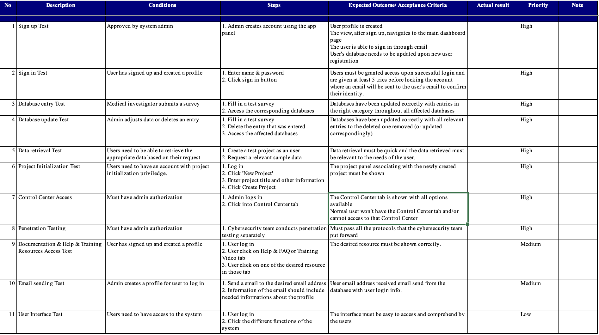

## Feature testing:
- RedCap functionalities testing:
- Survey creation
- Survey distribution
- Data logging
- Email integration testing
- Ensuring that emails are being sent to correct addresses
- Ensuring that authentication are being received correctly
- 2-step authentication testing
- Administrator function testing
- Various other features (Send-it & Communication between members)
- All tests are performed by our team and Mr. Tuan, the client of this project. As the
test documentation is provided thoroughly by the creator of REDCap, we can just
follow the testing provided in the documentation.
## Penetration testing:
- Collaboration with external vendors to ensure that the system meets the
required standards of cybersecurity
- Conduct meetings with pen-test team on semi-regular basis to keep track
of progress
## UAT testing
