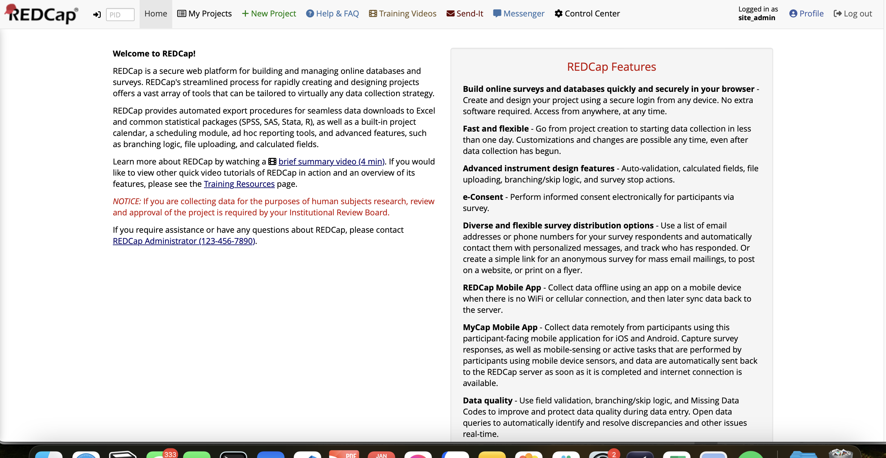

# Redcap platform for Vinuniversity
REDCap is a free, secure, web-based application designed to support data capture for research studies. REDCap provides automated export procedures for seamless data downloads to Excel and common statistical packages (SPSS, SAS, Stata, R), as well as a built-in project calendar, a scheduling module, ad hoc reporting tools, and advanced features, such as branching logic, file uploading, and calculated fields. For Vinuniversity, REDCap will aid customer with gathering personal informations of the targets and manage their datas efficiently. 
